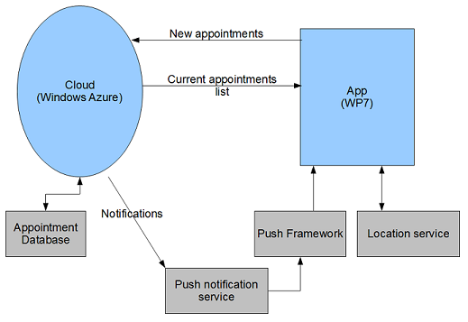

##Dynamic Event Scheduler repository

A planner and reminder system that is aware of and responds dynamically to the user's current location and time of day.

###Design

The system includes two primary components: the Mobile Client App and the Backend Cloud service. The app is responsible for all interactions with the user, and will run on a Windows Phone. User interactions include reminder displays and the entering of new appointments into the system. The cloud service holds the user's data and sends that data to the mobile device on request.

###Use cases
1. Reminder of a chore based on a specific time. For instance, if the user has to pick up a friend at 4:00 PM and has set the final reminder range to be 30 minutes, then the app will remind the user at 3:30 PM.

2. Reminder of a chore based on a specific location. For instance, the user wants to be reminded the next time she is in the office to scan and fax some documents. The app monitors the user's location and pops up a reminder when she enters the office.

3. Reminder of a chore based on a more general location, and optionally time. For instance, the user wants to be reminded to buy cat litter. The app monitors the user's location and pops up a reminder when he is near any of several pet supply stores. The reminder is not shown when the store in question is closed, or when the user has an appointment scheduled soon.

4. Reminder based on both location and time. For instance, the user has guests coming for dinner at 6:00 PM. If the user is still in the office at 5:15 PM, the app will remind the user to leave the office, as the app can calculate the distance between home and office to figure out that it approximately takes 45 minutes to travel.

5. Dismissal of reminders. The user will need to tell the system whether they have done the chore, so that the system knows whether to mark it as done.

6. Entering and editing appointments and reminders. The user will have an interface for entering appointments and chores into the system, and can specify time or times, location or locations, urgency, and so forth. The interface can include a map for entering location.

7. Display of pending reminders. The app will show the user what chores and appointments are scheduled, their times, and their locations.

8. Communication between family and roommates. Many chores can be done by any member of the household, but the household will not want them to be done twice. If each
member of the household has a copy of this app on their smartphone, the apps can be aware of this and only remind one person at a time. Chores such as buying kitty litter will be marked as done from all schedules for the household instead of just one.

###App UI
The app’s main screen makes use of the Pivot Control: 
  * The Pivot Control contains two individual PivotItem controls, each contains a listbox. Data is populated to the ‘All Tasks’ listbox from the Cloud Databases (see more information on the Cloud Section below).
    * The first PivotItem is the Notifications, which updates notifications to remind users of events based on time and/or location.
    * The second PivotItem is All Tasks, which lists all the upcoming to-do items for the users, with information such as preview icon, task name, location, deadline date and time.
  * On the bottom of the screen, the App implements the Application Bar class for easy access and controls of the App. There are two quick Button Icons: Add and Refresh. (More details below). Pressing the ‘...’ on the right of the Application Bar will bring up a more detailed Menu, where there are 3 Options:
    * Clear All Notifications: simply remove all current notifications on the list
    * Set My Location: set the user’s GPS/Location options
    * Set My Profile: set the user’s ID
  * The default GPS option is on, for the Demo purpose, we can set it to off and choose a preset location such as On Campus, Washington Ave St Paul or Airport to test Location-based notifications (without having to physically move to these places to test)
  * My Profile set a User ID for the app, to differentiate users on the Cloud Database, the ideal choice is to use the unique Device ID. (using GetDeviceUniqueID()). Since this is not possible on the Windows Phone Emulator, the current option is to manually set the user’s ID. The default value is 100, to test multi-users functionality, set a different ID for each user.
  * The Task Lists refreshes itself automatically, but the user can manually refresh with the Refresh icon on the application bar to instantly check the most up-to-date list. Users can add new task to the Task List by tapping on the Add icon on the application bar at the bottom of the screen. 
  * The Add icon button takes users to another screen, where they can add a new task with all the necessary information. The date and time can be selected using two components: <toolkit: DatePicker> and <toolkit: TimePicker>
  * On the main Tasks screen, users can also select a task, tap and hold the item on the list, a menu will be displayed using the ContextMenu from the same toolkit:
<toolkit: ContextMenuService.ContextMenu>. This menu allows the users to Delete: simply remove the task completely from the list.
  * All actions will be updated to the cloud databases instantly

###App side APIs
1. Internet Location Service API:
  * It defines the COM-based (Component Object Model) Internet location service based objects that let your application communicate with other applications over the Internet. A client application makes use of these objects through predefined sets of interfaces to each instance of the object.
  * IIlsMain interface represents the main object that manages all other ILS objects and is the first COM object a client application must create. Only one ILS object can be created per application instance.
  * All other objects are created through a method in other objects or by enumerating the objects. For example, we can retrieve an IIlsUser interface pointer through:
    * IIlsMain::CreateUser, IIlsMain::GetUser,
    * or through the IEnumIlsUsers interface retrieved through IIlsMain::EnumUsers,
    * or through the QueryInterface method.
  * ILS requires the client application to call it from a user interface (UI) thread. A message pump in the caller application is built so that the ILS can receive notification messages.

  * The notification mechanism uses the connectable object model in the COM architecture NetMeeting provides a software application programming interface (API) that lets programmers and Web-page designers include collaboration and conferencing for applications like sharing, chat, whiteboard, and file transfer.

2. Google Calendar API:
  * The client application uses the Calendar Data API to create new events, edit or delete existing events, and query for events that match particular criteria. 

3. Bing Maps:
  * There is a link in the UI connected to the Silverlight and Bing Maps SDK that take the location of desired place or store determined by the output of the above ILS API and show the location on bing maps.
  * Using the Silverlight Application from the available templates in visual studio, the app creates a map view of desired objects.

###Cloud side Database
Event database structure

  * The app has a database stored in the Azure cloud using the Azure Storage Services. The data is stored in the form of tables and hence the Table Service is used for storage, updation, insertion, deletion and querying of these tables. The database structure is shown below:

  * In this table, the tasks that the user wishes to do are stored along with the deadline by which they need to complete it. In addition to the fields above, each task is associated with a GUID for ease of reference.

  * The location table stores the GPS coordinates of all locations known to the system.

###Cloud side APIs
1. Storage Services API: 

    REST is a light weight substitute for web services. It stands for Representational State Transfer. The REST APIs for the Windows Azure Storage services provides developers means to access the Blob, Queue, and Table services in Windows Azure or in the development environment. In our system, the REST APIs are used to access all the storage services. Storage services can be accessed from within a service running in Windows Azure, or directly over the Internet from any application that can send an HTTP/HTTPS request and receive an HTTP/HTTPS response.

2. Table Service Support for .NET Client Library Constructs: 

    This is the client library that will be used with the Table Service. The two main constructs of the client library are the DataServiceContext class and the DataServiceQuery class. DataServiceContext is used to represent the runtime context with a specified data service. The DataServiceQuery class is used to represent a query against storage specified using the ADO.NET Data Services URI syntax.

3. System.Data.Services.Client Namespace

    This is the namespace that has the classes DataServiceContext , DataServiceQuery etc. that will support the interaction of the client with the database. The app will make use of classes from this namespace.

###Communication between App & Cloud:
1. Appointment scheduling:
  * The scheduling of an appointment is initiated by the app and sent to the cloud service, which saves the appointment in the database. This is accomplished via the Windows Communication Foundation (WCF). 
  * When using WCF, both the app and the cloud service must be running. The WCF service contract includes a public interface with the following function prototype: [OperationContract] bool AddTask(long UserId, long GroupId, Task TheTask);
  * The Task class is defined to include an appointment's name, date, time, etc. The cloud service is responsible for implementing this function. The user ID and group ID are used to associate this task with a user or group of users. If the task is for a single user, the user ID and group ID are the same. 

2. Retrieving appointment lists:
  * Appointment lists are kept on the cloud service, and the app will periodically request the current list in order to display it to the user. This is accomplished via the Windows Communication Foundation (WCF).
  * The WCF service contract includes a public interface with the following function prototypes:
    * [OperationContract] List<Task> GetAllTasks(List<long> GroupIds);
    * [OperationContract] List<Task> GetTasksDueSoon(List<long> GroupIds);
  * The cloud service is responsible for implementing these functions, which are called by the app when it wants an appointment list. The group ID list specifies the groups to which the tasks belong. The first function returns a list of all tasks associated with those group IDs, while the second returns the subset which has a deadline within the next 24 hours.

3. Retrieving nearby locations:
  * A global list of points of interest is kept on the cloud service, and the app will periodically send the cloud its current coordinates in order to retrieve a list of locations nearby. This is accomplished via WCF.
  * The WCF service contract includes a public interface with the following function prototype:
    * [OperationContract] List<Location> GetNearbyLocations(System.Device.Location.GeoCoordinate Coordinates, float Dist);
  * This function, implemented by the cloud service, returns a list of locations in the database within Dist miles from the specified coordinates.
